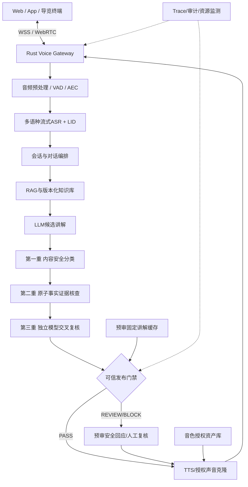
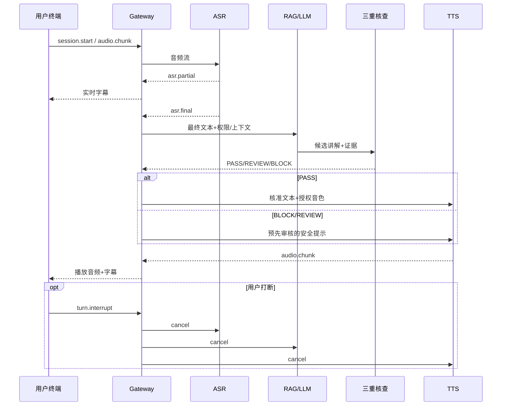

# 模块化多语种语音流水线技术架构

## 设计原则

- Rust Gateway承担协议、鉴权、配额、会话、路由和审计；Python模型服务负责ASR、TTS、Guard与评测。
- 模型适配层隔离供应商，实现可切换的Provider接口；统一语言、音频编码、模型版本和可取消任务。
- 第三方检索材料为不可信输入，不得覆盖权限或系统策略。
- 已预审的固定讲解可缓存；动态事实必须经三重核查发布门禁后才能播报。
- 复用缓存必须核对知识版本、语种、审核版本、权限、音色授权与过期时间。
- 请求全链路携带request_id、session_id、turn_id和trace_id；打断必须取消后续输出。

## 端到端架构

## 模块契约

| 模块 | 输入 | 输出 | 故障控制 |
|---|---|---|---|
| Gateway | Token、音频帧、会话命令 | 字幕/音频/状态 | 限流、断连、取消 |
| 预处理 | PCM/Opus | 降噪/分帧/VAD | 不可解码则报错 |
| ASR | 流式音频、语言候选 | partial/final、语言、时间戳（必要时独立对齐） | 超时/降级 |
| Explanation | ASR终稿、上下文、权限、知识范围 | 候选文本与引用 | 无证据不输出确定事实 |
| Trust | 候选事实、证据、策略 | PASS/REVIEW/BLOCK、reason_codes、evidence_refs | fail-closed |
| TTS | 审核通过的文本、合法音色ID | 流式音频、字幕 | 无授权拒绝、打断取消 |

## 三重核查的语义

1. **风险审核**：规则和Guard，记录risk_type、severity、model_revision、policy_version。
2. **事实核查**：原子事实抽取；关联权威证据版本；每项标记SUPPORTED、CONTRADICTED或INSUFFICIENT。
3. **独立复核**：与生成器不同模型或审核策略复检事实和引用，不使用模型多数投票替代可查证证据。

审核FAIL、超时、证据过期、授权撤销均禁止进入确定性讲解TTS。用户可获得预审核的安全提示语。

## 交互时序

## 性能约束

区分ASR最终稿延迟、TTS首可播放音频块延迟和用户结束发言到终端首声的端到端延迟。预审核固定讲解与动态完整核查分别测试；先测单路，后测并发。不得提前播放未经核查的动态事实。
