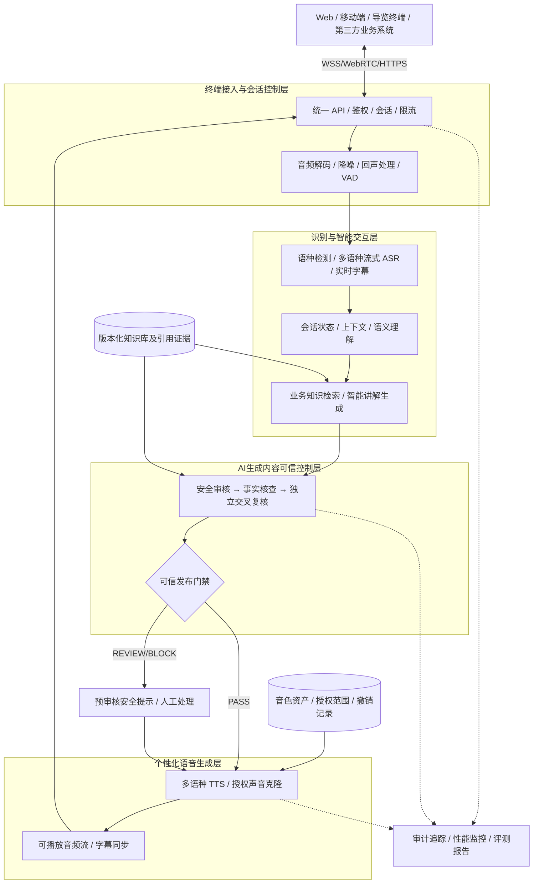
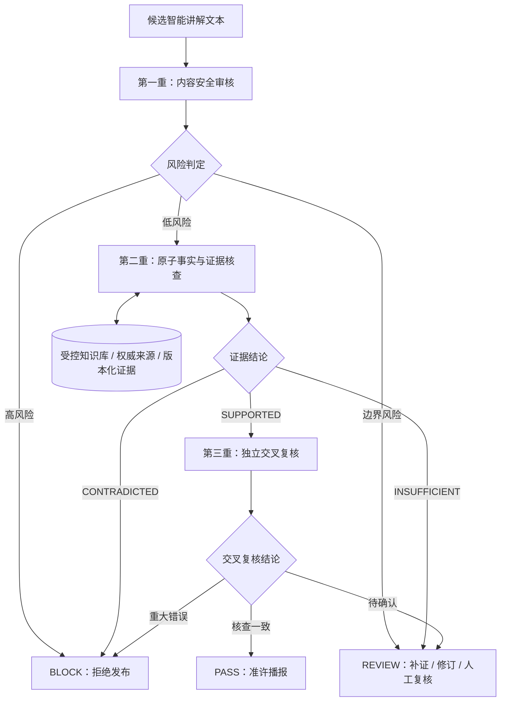
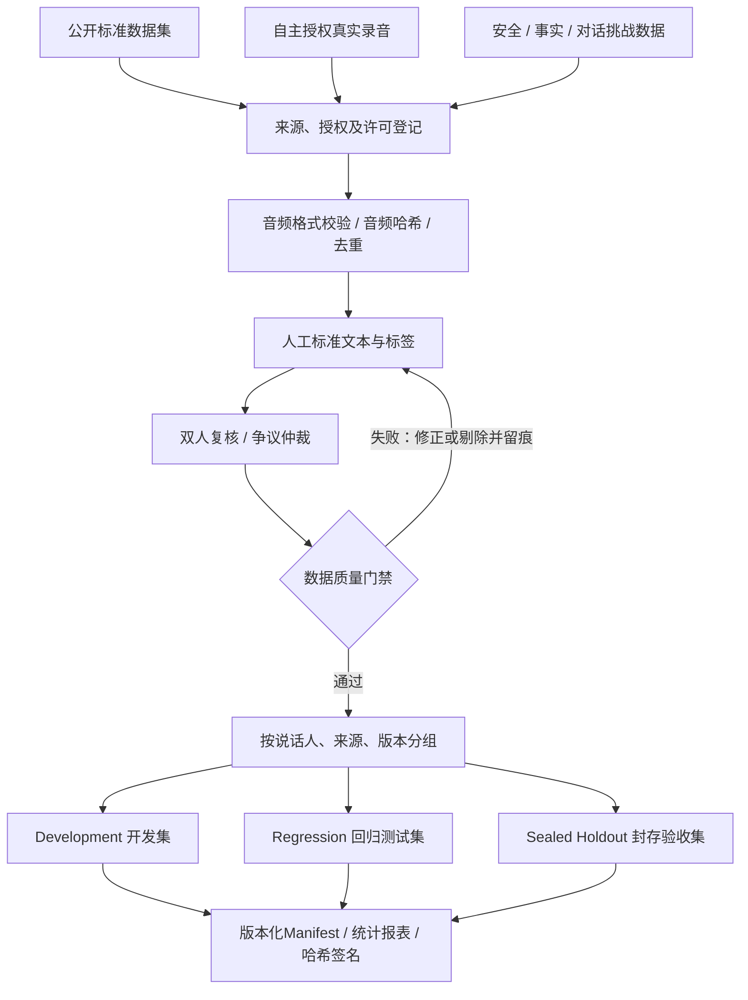
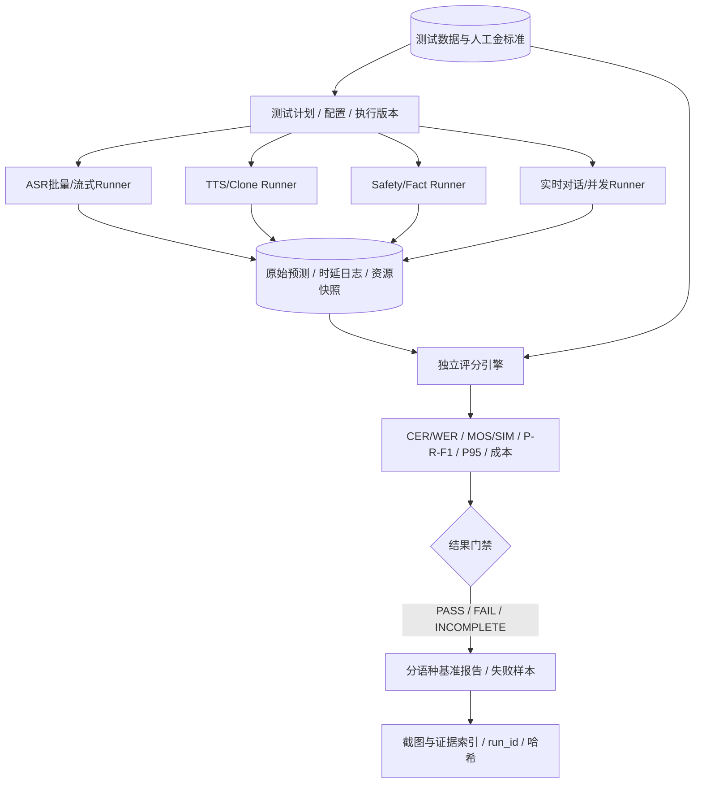

# 语音技术方案配套架构图（可编辑Mermaid）

> 版本V2.0；本页图表属于**DESIGN设计图**，不可当作产品运行截图。标书定稿时可导出为SVG或高分辨率PNG，保留图号及说明。

## 图1：多语种语音系统总体架构

**图注**：语音处理、智能讲解与三重核查采用独立服务化接口；动态事实必须通过发布门禁才能进入语音合成。音色管理保留授权核验与撤销能力。

## 图2：三重核查与发布控制

**图注**：三重核查为“安全性、证据支持性、独立复核”三个不同判定层，不等同于同一事实连续调用三个模型进行投票。任一关键步骤异常采用安全降级。

## 图3：自主测试数据集构建流程

**图注**：模型调参不得访问封存验收集金标准；增强音频不能独立计入原始录音数；若某语种没有足够真实录音和双审金标准，该语种必须标注未达到正式验收准备条件。

## 图4：自动化测试与评测系统架构

**图注**：评测系统与被测语音服务逻辑解耦；原始输出持久化、评分器可单独重跑；OOM、超时、评分缺口不得作为合格结果。未运行属于NOT_RUN。

## 标书导图要求

- 导出图号不变，保留“设计示意图”属性和版本。
- 导出前检查中文文字是否溢出、箭头和连接是否丢失，统一字体和版式。
- 不在图片内填入未经实测的准确率、响应速度、并发和成本数值。
