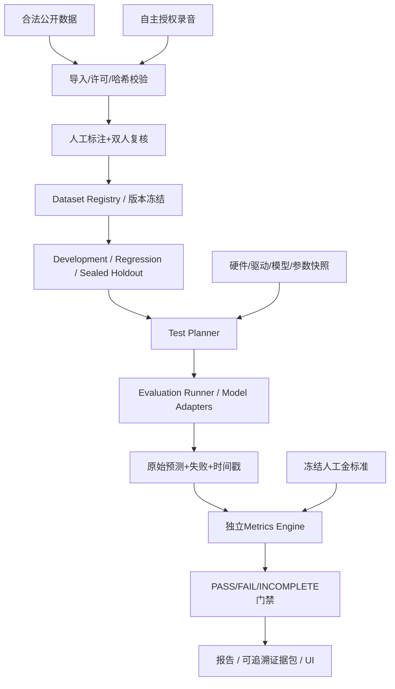

# 自主语音评测系统架构与实施规范

## 1. 目标与边界

构建独立于业务系统的自动化评测平台，支持批量和流式ASR、TTS与授权声音克隆、Guard/事实核查、实时对话、并发容量、成本，以及生成可核查的标书证据。初始在Windows本地RTX3060配合CPU评价器运行，不强制Docker或Kubernetes。



## 2. 核心子系统

| 子系统 | 功能 |
|---|---|
| Dataset Registry | 来源许可、文件与音频哈希、speaker分组、防泄漏、数据版本 |
| Test Planner | 生成run_id、配置与环境快照、数据集的合法范围 |
| Model Adapter | 统一batch/stream推理接口，模型版本、支持语种、加载与健康检查 |
| ASR Runner | 文件与音频流、partial/final、时间戳、实时率 |
| TTS/Clone Runner | 参考声音、授权检查、文本音频一致性、音色及延迟 |
| Safety/Fact Runner | Guard分类、原子事实/证据、三层发布判断 |
| E2E/Load Runner | 多轮对话/打断/网络抖动、稳态并发压测 |
| Metrics Engine | CER/WER、MOS/SIM、Precision/Recall/F1、事实支持、P95 |
| Report Builder | Markdown、HTML、CSV/JSON、错误列表、截图和哈希索引 |
| Review Console | 标注审核、报告审阅，禁止访问密封Holdout金标准 |

建议Python pytest、JiWER、Hugging Face Datasets、Locust/k6、OpenTelemetry/Prometheus；Rust Gateway独立管理面向用户的接口与会话。

## 3. 推荐工程目录

```text
eval/
  datasets/   # manifest schema/validator/permission/split
  runners/    # ASR/TTS/Guard/Fact/E2E/Load
  metrics/    # scoring and statistics, CPU runnable
  reports/    # templates/rendering/evidence
  tests/      # evaluation system self-tests
```

实际音频、声音授权、密封Holdout标准答案与运行证据均存储在Git仓库外受控位置；仅公开Schema、代码和脱敏统计。

## 4. 任务记录契约

每次运行生成不可覆盖的run_id，记录dataset_id/version/hash、model_id/revision/weight_hash、git_commit、hardware_id、driver_version、CUDA/框架版本、dtype/quantization、batch、context、prompt/policy版本、normalizer_version、started_at/finished_at和完整config_hash。

输出建议：

```text
runs/<run_id>/
  run_manifest.json
  predictions.jsonl
  errors.jsonl
  metrics.json
  metrics_by_language.csv
  latency.csv
  hardware.json
  failure_cases.csv
  report.md
  evidence_index.json
  screenshots/
```

predictions包含sample_id、raw_prediction、normalized_prediction、elapsed_ms、reference_hash；错误记录包含sample_id、stage、type、message、retry_count。**模型失败不得从准确率分母无声删除**：报告列出尝试样本数、成功样本数、处理错误和排除理由。

状态NOT_RUN、RUNNING、PASS、FAIL、INCOMPLETE。OOM、缺失金标准、模型无输出、数据错误为INCOMPLETE，不得当成100%识别正确率。

## 5. 执行顺序

1. 冻结并验签数据集与音频哈希，验证许可及Gold权限。
2. 验证模型/配置/环境、固定随机种子和正常化版本。
3. 预热模型并记录冷启动与热启动的策略。
4. 运行原始数据，收集逐条预测、失败事件、机器资源与耗时。
5. 用独立CPU评分器与人工金标准比对，得到S/D/I/N、WER/CER、F1等。
6. 分语种、说话人、噪声、设备、语句类别聚合并估计95%CI。
7. 测试1/2/4/8/16/32路阶梯并发，每档预热后稳态≥15min；进行≥24h稳定性/故障测试。
8. 生成报告，按门禁标记PASS/FAIL/INCOMPLETE，归档原始日志及图片。

测试平台M1先完成合法的100条真实ASR音频→人工转写→评分→Markdown报告，**不用于95%正式验收**。

## 6. 评测系统必须通过的基础自测

| 编号 | 操作 | 预期 |
|---|---|---|
| EVAL-01 | 相同文本 | WER/CER=0 |
| EVAL-02 | 手算替换/删除/插入 | 输出与人工S/D/I/N一致 |
| EVAL-03 | 空参考/静音 | 不除零、不掩盖幻觉 |
| EVAL-04 | 混合语言/数字/标点 | 固定归一化规则可重放 |
| EVAL-05 | 原始文件篡改 | 哈希门禁拒绝 |
| EVAL-06 | 同speaker跨不允许split | 数据泄漏门禁失败 |
| EVAL-07 | GPU OOM/超时 | INCOMPLETE |
| EVAL-08 | Guard混淆矩阵 | P/R/F1与手算一致 |
| EVAL-09 | 无证据判事实SUPPORTED | 阻断 |
| EVAL-10 | 不同硬件/配置 | 创建独立run |
| EVAL-11 | 同一原始预测重复评分 | 完全一致 |
| EVAL-12 | 隐藏失败样本抬高指标 | 数据完整性门禁失败 |

## 7. 证据质量

正式报表必须有模型及权重哈希、真实GPU/驱动、数据版本与音频来源、原始预测、归一化规则、测试开始和结束时间、错误及排除数量。没有运行不得制作仿真“实测”截图。封存Holdout只允许正式评测执行器按最小权限读取，开发人员不得借调参获知答案。
